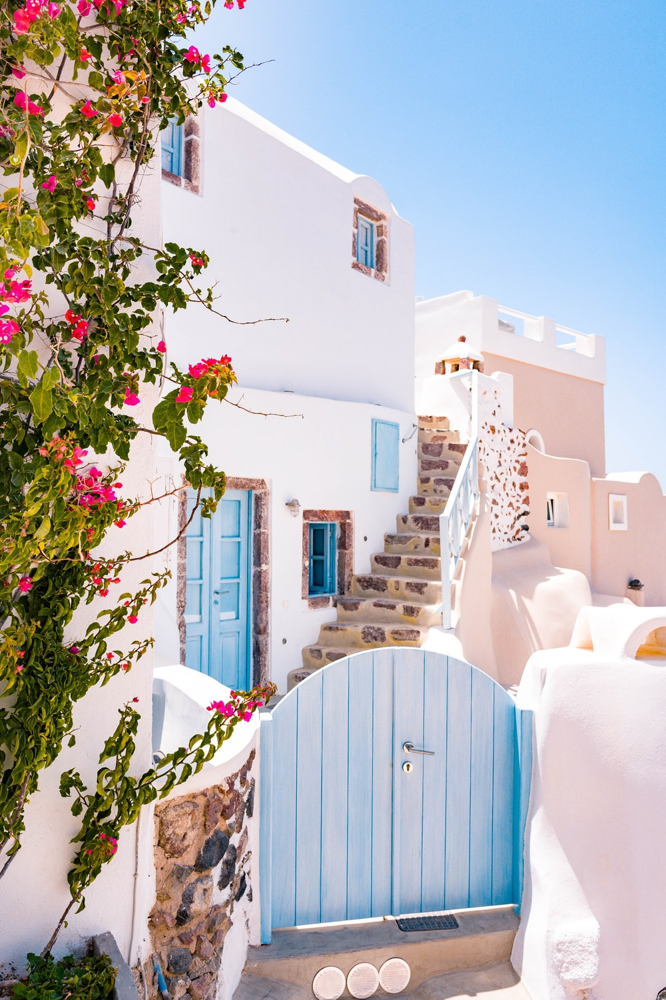

<!DOCTYPE html>
<html lang="en">
<head>
    <meta charset="UTF-8">
    <meta http-equiv="X-UA-Compatible" content="IE=edge">
    <meta name="viewport" content="width=device-width, initial-scale=1.0">
    <title>Dhumketu</title>
    <link rel="stylesheet" href="css/all.min.css"/>
	<link rel="stylesheet" href="css/fontawesome.min.css"/>
    <link rel="stylesheet" href="style.css">
</head>
<body>

<section id="heroSection">

    

            

            <h2>Bring Your Kitchen to</h2>

            
You deserve to feel good about the products you are incorporating into
            your home. Whether you are a designer, architect or individual, Laminam
            products will help transform your kitchen into a space you can boast about.
            Our long-lasting, reliable and sustainable products are made with 
            state-of-the-art technologies that will ensure you get the look you want
            without compromising on performance.
            

            <button id="heroLeftSideBtn"><a href="#">Discover Why Laminam is Better</a></button>
    

    

        

    

</section>

<section id="familyCleanSection">

    

        <h2>Keep Your Family Clean & Safe In The Kitchen</h2>

        
With your kitchen being a space in your house you spend the majority of your
             time in, it makes sense that your family’s health and safety is a priority. 
             Our superior kitchen countertop surfaces are durable and easy to clean.
              Laminam has no special maintenance requirements which means you can simply 
              clean the surface with warm water and natural detergents.
        

         

            
Here’s what you can expect from Laminam Surfaces:

            

                

                    
                    <h3>Ideal for Places Maximum   Hygiene is Needed</h3>
                
 
    
                

                    
                    <h3>Does Not Allow Mould,   Bacteria, & Fungi to Grow</h3>
                
 
    
                

                    
                    <h3>Stain Resistant</h3>
                

            

           
            

                

                    
                    <h3>Not damaged by    Detergents & Cleaning   Products</h3>
                

    
                

                    
                    <h3>Chemical Resistant</h3>
                

    
                

                    
                    <h3>Resistant to Scratches &   Abrasions</h3>
                

            

            
        
 

        

            <button id="familyCleanBtn"><a href="#">Discover Why Laminam is Better</a></button>
        

    

</section>

<section id="kitchenSection">

    

        

            <h2>Good For You & Great For The Environment</h2>
            
Our Laminam Kitchen Countertop surfaces are made from 100% natural materials.
                 We create a completely sustainable and recyclable product that delivers on 
                 elegance and class while being respectful to our environment,
            

            
Thanks to state-of-the-art technologies and closed-cycle production processes, 
                our product development is characterised by low energy and water consumption,
                 zero polluting emissions and reduced CO2 emissions, with nothing other than
                  water vapour emitted into the atmosphere.
            

            
Laminam countertop surfaces are products you can feel good about.

    
        

    
        

            
        

    

</section>

<section id="dreamKitchenSection">

    

        <h2>Dream Big With Endless Possibilities</h2>

        

            
        

        

            
Building your dream kitchen has never been easier with Laminam’s wide selection
                 of materials and finishes to choose from.
            

           

                <li> <i class="fas fa-caret-right"></i> More than 130 different surfaces</li>
                <li> <i class="fas fa-caret-right"></i> 3 main sizes of different thicknesses</li>
                <li> <i class="fas fa-caret-right"></i> 6 different superficial finishes</li>
           

           

            If you’re looking for materials that will match with your floors and cladding,
             we have something for you. If you’re looking for a specific size, we can make
              it happen. Take a look at some of our samples below.
           

           
Not sure which styles to pick?

           <button id="dreamKitchenBtn"><a href="#">Discover Why Laminam is Better</a></button>

        

    

</section>

<section id="aboutSection">

    

        
 

            <h2>Learn About Laminam</h2>

            
“We do in 4 hours what nature does in 4,000 years. We use the same raw
                 materialscontained in natural stones and add the most innovative equipment
                  and technologies to reproduce a product that replicates the movement of the 
                 earth’s layers, the heat of volcanoes and the earth’s core.”
            

            
Here at Laminam, we create superior surfaces to inspire designers, 
                architectsand people to build spaces they can live, work and enjoy.
                We’ve been buildingtimeless products for over 20 years with a team of
                incredibly talented individuals who are focused on technological innovation,
                providing a dynamicapproach, growing in the field of research and development,
                 flexibility,excellence, internationalization and eco-sustainability.
            

            
All of our products are made in Italy with a focus on quality, design and durability.
            

        

        

            
        

    

</section>  

<section id="contactSection">

    

        

            <form action="">
                <input color="white" type="text" placeholder="Name">
                <input type="text" placeholder="Surname">
                <input type="email" placeholder="Email">
                
               <select id="">
                <option value="">You are a business or Consumer</option>
                <option value="">Option 1</option>
                <option value="">Option 2</option>
               </select>

               <select id="">
                <option value="">Do you want more information?</option>
                <option value="">Option 1</option>
                <option value="">Option 2</option>
               </select>

               <select id="">
                <option value="">Do you want to request a simple</option>
                <option value="">Option 1</option>
                <option value="">Option 2</option>
               </select>

               <button id="contactFormBtn">REQUEST INPORMATION</button>

            </form>
        

        

            <h3>Need More Information?</h3>

            
Book a consultation and advice from our experts.
              We would love to help you find a solution for your needs.
            

            
Wondering what comes next?

            

                <li><i class="fa fa-caret-right" aria-hidden="true"></i>Book an appointment with a retailer</li>
                <li><i class="fa fa-caret-right" aria-hidden="true"></i>Receive a catalogue</li>
                <li><i class="fa fa-caret-right" aria-hidden="true"></i>Get access to one-on-one support</li>
                <li><i class="fa fa-caret-right" aria-hidden="true"></i>Speak with a sales representative</li>

            

        

    

</section>

<footer>
    
© 2021 Laminam Spa All Rights Reserved

</footer>

</body>
</html>

